# Parchee Edge

**Parchee Edge** is a local-first medical scribe and claim-readiness assistant for low-connectivity clinics. It listens to a consultation, uses **Gemma 4 audio understanding through llama.cpp** to extract structured encounter data, and then runs offline ICD-10-CM / ICD-10-PCS coding so a clinician can review a cleaner, claim-ready record.

The project is built for the Kaggle Gemma 4 Good Hackathon. The core goal is not diagnosis automation; it is faster, private, clinician-controlled documentation.

## What It Does

| Feature | Description |
| --- | --- |
| Local Gemma 4 scribe | Browser microphone audio is segmented by backend VAD and sent to local Gemma 4 via `llama-server`. |
| Structured clinical updates | Gemma 4 returns strict JSON updates for demographics, symptoms, vitals, history, medications, procedures, diagnoses, and claim-relevant social fields. |
| Gemma 4 summaries and notes | Post-visit summaries and `/api/generate-note` clinical note drafts use the same local llama.cpp endpoint. |
| Adaptive audio windows | Speech starts and ends are detected automatically, so silence is skipped and short utterances do not wait for a full fixed buffer. |
| Offline ICD/PCS coding | ICD-10-CM and ICD-10-PCS suggestions use local TF-IDF, char n-gram, and ChromaDB semantic search. |
| Claim review workflow | Clinicians can inspect auto-coded encounters, search code databases, and confirm billing evidence. |
| Encrypted storage | Patient fields are encrypted at rest with AES-256-GCM before database persistence. |

## Architecture

```mermaid
flowchart LR
    Mic["Browser microphone"] --> Worklet["AudioWorklet\n16 kHz PCM"]
    Worklet --> WS["WebSocket\n/ws/live-consultation"]
    WS --> VAD["FastAPI adaptive VAD\nspeech windows only"]
    VAD --> WAV["PCM -> WAV"]
    WAV --> Llama["Managed llama-server\nGemma 4 + mmproj"]
    Llama --> JSON["Strict JSON\ntranscript + updates"]
    JSON --> UI["Live clinical form"]
    UI --> EHR["Commit to EHR"]
    EHR --> Coding["Offline ICD-10-CM / PCS coding\nTF-IDF + ChromaDB"]
    Coding --> Review["Billing / claim review"]
```



## Repository Layout

```text
backend/
  app/
    api/                     REST and WebSocket routes
    services/
      llama_server_manager.py       downloads model assets and starts llama-server
      llama_cpp_gemma_service.py    Gemma 4 audio extraction pipeline
      icd_coding_service.py         ICD-10-CM hybrid coding
      procedure_coding_service.py   ICD-10-PCS hybrid coding
      summarizer.py                 local Gemma 4 encounter summary
    database.py              encrypted persistence
  llama_templates/           no-thinking Gemma 4 chat template
  tests/                     llama.cpp adapter and parsing tests

frontend/
  app/                       Next.js app routes
  hooks/useAudioStream.ts    microphone capture hook
  public/worklet.js          browser PCM worklet

docs/
  kaggle_writeup.md          submission writeup draft
```

## Requirements

- Windows, Linux, or macOS
- Python 3.11+
- Node.js 20+
- PostgreSQL for persistent EHR storage
- A llama.cpp build with Gemma 4 multimodal support
- Recommended for demo: NVIDIA GPU + CUDA-enabled `llama-server`

For local Windows development, place your Windows llama.cpp binaries here:

```text
backend/llama_cpp/bin/llama-server.exe
backend/llama_cpp/bin/*.dll
```

Docker Compose does not need a local Linux llama.cpp binary. It pulls the CUDA server image directly from GitHub Container Registry:

```text
ghcr.io/ggml-org/llama.cpp:server-cuda
```

The backend can download the Gemma 4 GGUF model and multimodal projector automatically into:

```text
backend/llama_cpp/models/gemma-4.gguf
backend/llama_cpp/models/mmproj.gguf
```

The default download URLs are configured in `.env.example`.

## Environment

Create local env files:

```powershell
Copy-Item .env.example .env
Copy-Item backend\.env.example backend\.env
```

Generate a real AES key:

```powershell
[Convert]::ToBase64String((1..32 | ForEach-Object {Get-Random -Maximum 256}))
```

Put that value in `AES_256_KEY`.

For CUDA offload on Windows, set:

```env
LLAMA_SERVER_EXTRA_ARGS=-ngl 999
```

No hosted LLM or speech API key is required for the main pipeline.

## Local Development

### 1. Backend

```powershell
cd backend
pip install -r ..\requirements.txt
python -m spacy download en_core_sci_md
python -m uvicorn app.main:app --reload --port 8003
```

On startup, the backend will:

1. Load `backend/.env`.
2. Download Gemma 4 model files if missing.
3. Start `llama-server` on `127.0.0.1:8080`.
4. Warm the ICD-10-CM and ICD-10-PCS coding services.

### 2. Frontend

```powershell
cd frontend
npm install
npm run dev
```

Open [http://localhost:3000](http://localhost:3000).

## Docker Compose

```powershell
docker compose up --build
```

Docker starts four services:

1. `gemma-models`: downloads Gemma 4 GGUF and mmproj into a persistent Docker volume.
2. `llama-server`: runs `ghcr.io/ggml-org/llama.cpp:server-cuda` with `--n-gpu-layers 999`.
3. `backend`: connects to `http://llama-server:8080`.
4. `frontend`: serves the browser app.

Docker GPU mode requires NVIDIA Container Toolkit / Docker GPU support. If Docker cannot see your NVIDIA GPU, use the local Windows path instead.

Services:

- Frontend: [http://localhost:3000](http://localhost:3000)
- Backend API: [http://localhost:8003](http://localhost:8003)
- Managed llama.cpp endpoint: [http://localhost:8080](http://localhost:8080)
- PostgreSQL: `localhost:5432`

To use CUDA 13 instead of CUDA 12:

```powershell
$env:LLAMA_CPP_DOCKER_IMAGE="ghcr.io/ggml-org/llama.cpp:server-cuda13"
docker compose up --build
```

## Verification

Backend tests:

```powershell
cd backend
python -m unittest discover -s tests
```

Frontend build:

```powershell
cd frontend
npm run build
```

## Hackathon Materials

- Kaggle writeup draft: [docs/kaggle_writeup.md](docs/kaggle_writeup.md)
- Architecture summary: [architecture.md](architecture.md)
- Demo flow:
  1. Start backend and frontend.
  2. Begin consultation.
  3. Speak a short Hinglish or English clinical encounter with vitals.
  4. Watch fields populate from local Gemma 4.
  5. Commit to EHR.
  6. Open Diagnostics/Billing to show ICD/PCS suggestions and claim review.

## Safety Note

Parchee Edge is documentation support software. It organizes clinician-spoken information and suggests billing codes for review. It should not be presented as autonomous diagnosis, treatment, or insurance approval software.
