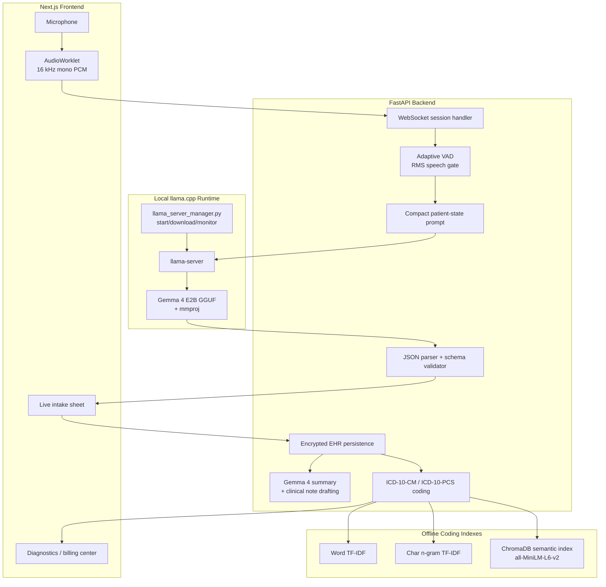

# Parchee Edge Architecture

Parchee Edge is organized around one local inference loop: browser audio becomes short speech windows, Gemma 4 converts those windows into structured clinical updates, and local coding services turn reviewed encounters into billing-ready evidence.

## System Diagram



## Audio Pipeline

1. The browser captures microphone input and converts it to 16 kHz mono PCM.
2. Audio frames are streamed to `/ws/live-consultation`.
3. The backend uses adaptive VAD to ignore silence and flush natural speech windows.
4. Each speech window is wrapped as WAV and sent to local `llama-server`.
5. Gemma 4 returns strict JSON:

```json
{
  "transcript": "patient says fever for three days",
  "updates": [
    {"field": "chief_complaint", "value": "fever for 3 days"},
    {"field": "symptoms", "value": ["fever"]}
  ]
}
```

## Gemma 4 Runtime

The backend manages `llama-server` directly so the demo has a single startup path.

Startup responsibilities:

- Download `gemma-4.gguf` and `mmproj.gguf` if they are missing.
- Start `llama-server` with the custom no-thinking template.
- Use `--reasoning off`, `--reasoning-budget 0`, and `--ctx-size 2048`.
- Add GPU offload through `LLAMA_SERVER_EXTRA_ARGS=-ngl 999` when available.
- Stream llama.cpp logs into backend logs for debugging.

Primary environment variables:

```env
LLAMA_SERVER_AUTOSTART=true
LLAMA_SERVER_BINARY=llama_cpp/bin/llama-server.exe
LLAMA_SERVER_MODEL=llama_cpp/models/gemma-4.gguf
LLAMA_SERVER_MMPROJ=llama_cpp/models/mmproj.gguf
LLAMA_SERVER_CTX_SIZE=2048
LLAMA_SERVER_THREADS=4
LLAMA_SERVER_EXTRA_ARGS=-ngl 999
```

## Structured Extraction Schema

Gemma 4 updates are accepted only if their field names are in the backend schema. Supported fields include:

- `name`, `age`, `gender`
- `chief_complaint`, `symptoms`
- `medical_history`, `family_history`, `allergies`, `medications`, `procedures`
- `ration_card_type`, `income_bracket`, `occupation`, `caste_category`, `housing_type`, `location`
- `tentative_doctor_diagnosis`, `initial_llm_diagnosis`, `transcript_summary`
- `vitals.temperature`, `vitals.blood_pressure`, `vitals.pulse`, `vitals.spo2`

List fields are merged and deduplicated across speech windows. Empty or malformed model responses are treated as no-op chunks so silence and noise do not crash the consultation.

## Coding Pipeline

ICD and procedure coding are separate from Gemma 4 generation. This keeps the app explainable and fast:

- Exact code lookup returns immediately.
- Word TF-IDF handles direct clinical terminology.
- Character n-gram TF-IDF handles partial words and typos.
- ChromaDB semantic search handles concept-level similarity.

This makes the coding path offline after initial dependency setup and avoids sending patient records to a cloud embedding API.

## Privacy Position

The main pipeline is local-first:

- Patient audio is processed by local Gemma 4 through llama.cpp.
- Coding retrieval runs locally.
- Patient data is encrypted before storage.
- No hosted LLM or speech API is required for the demo path.
